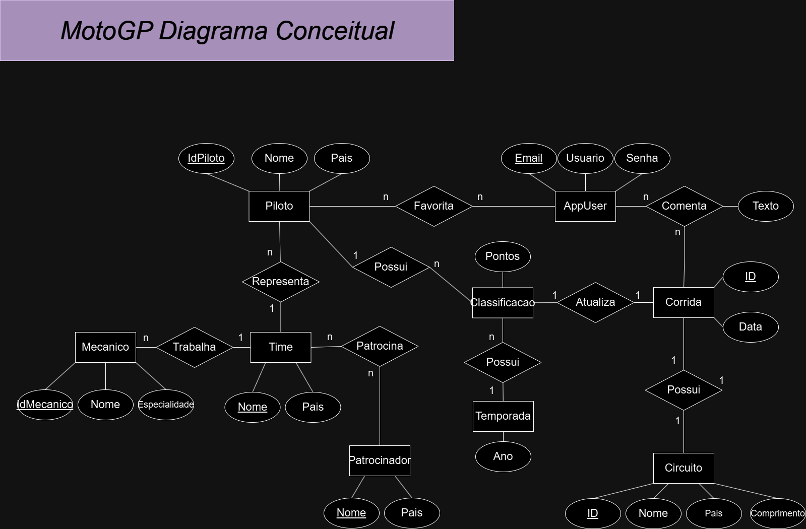
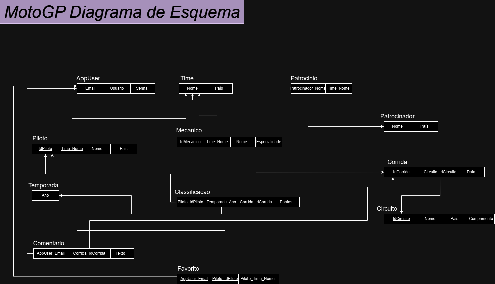
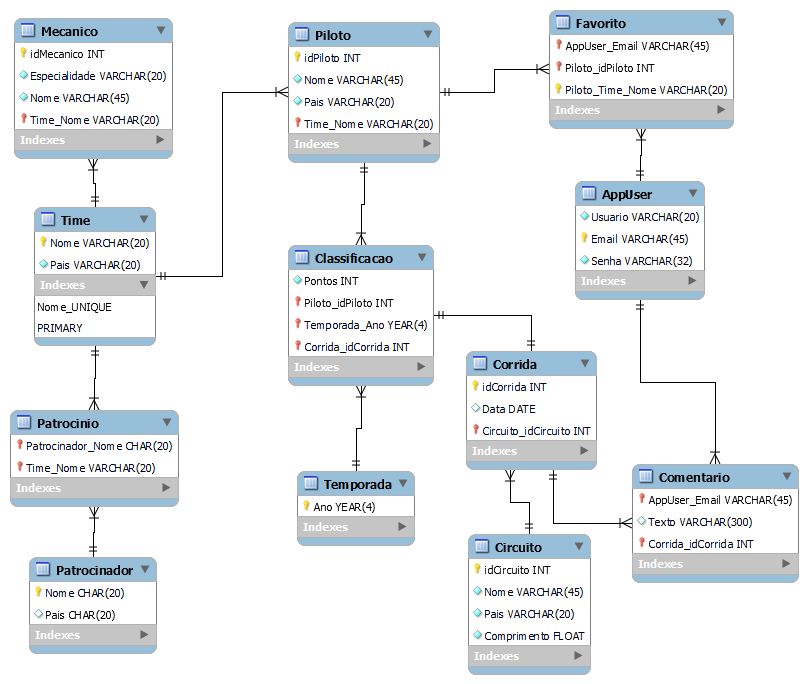

## MotoGP DB (Minimundo)

O MotoGP é a principal categoria do Campeonato Mundial de Motovelocidade, reunindo as melhores equipes, pilotos e mecânicos em uma competição emocionante em circuitos de todo o mundo. As equipes, como Yamaha, Honda e Ducati, buscam aperfeiçoar suas máquinas e estratégias para alcançar a vitória nas corridas, realizadas em circuitos renomados como o Circuito de Jerez, em Espanha, e o Circuito das Américas, nos Estados Unidos. Os pilotos, estrelas como Valentino Rossi, Marc Márquez e Jorge Lorenzo, enfrentam desafios únicos em cada corrida, buscando conquistar pontos para alcançar a liderança na classificação geral. Os mecânicos das equipes desempenham um papel crucial, ajustando as motos para garantir o melhor desempenho em cada pista. Os patrocinadores, como a Red Bull e a Monster Energy, apoiam as equipes e contribuem para o espetáculo emocionante do MotoGP. Os fãs de todo o mundo acompanham de perto cada corrida, criando uma comunidade global de entusiastas do motociclismo.

* **Equipe:** Representa as equipes participantes do MotoGP, como Yamaha, Honda, Ducati, etc. Cada equipe possui um nome, país de origem e pode ter vários pilotos e mecânicos associados.
* **Piloto:** Representa os pilotos que competem no MotoGP. Cada piloto tem um nome, país de origem, equipe atual e pode ter participado de várias corridas em diferentes temporadas.
* **Mecanico:** Representa os mecânicos que trabalham para uma equipe no MotoGP. Cada mecânico tem um nome, especialidade (por exemplo, motor, suspensão, eletrônica) e pode pertencer a apenas uma equipe.
* **Circuito:** Representa os circuitos onde as corridas do MotoGP são realizadas. Cada circuito tem um nome, país, comprimento da pista e pode hospedar várias corridas em diferentes temporadas.
* **Corrida:** Representa as corridas individuais do MotoGP realizadas em um circuito específico em uma determinada temporada. Cada corrida tem uma data, localização (circuito), vencedor e classificação de todos os pilotos.
* **Temporada:** Representa uma temporada completa do MotoGP, que inclui várias corridas realizadas em diferentes circuitos ao longo de um ano. Cada temporada tem um ano, várias corridas e uma classificação final dos pilotos e equipes.
* **Classificação:** Representa a classificação final dos pilotos e equipes em uma temporada específica do MotoGP. A classificação inclui a posição final, pontos acumulados e outras estatísticas relevantes.
* **AppUser:** Representa os usuários do sistema, que podem ser fãs, jornalistas ou qualquer pessoa interessada no MotoGP. Os usuários podem criar listas de favoritos e comentar resultados de corridas.
* **Patrocinador:** Representa os patrocinadores envolvidos no MotoGP. Cada patrocinador tem um nome, país de origem e pode patrocinar uma ou mais equipes.

### Diagrama Conceitual

### Diagrama Esquema

### Pé de galinha

### Interact

pip install mysql-connector-python streamlint

execute app.py

MySQL server should be running, created and populated

You can interact with the tables using the streamlint interface, but keep in mind that you should respect the relationships. For example, create an account with email X before commenting a race with email X, and so on.